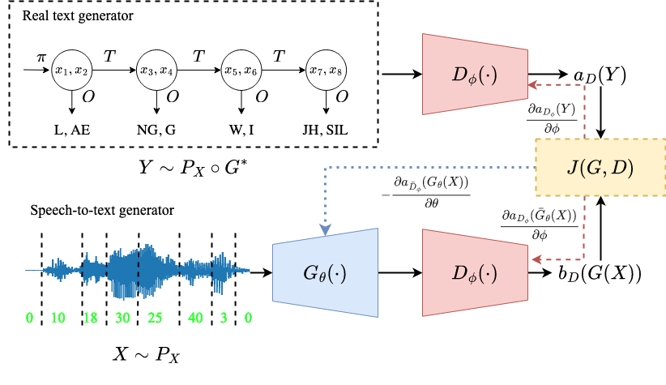

# Experiment Code for a Theory of Unsupervised Speech Recognition 
<div align="middle"></div>
This repository contains the source code for the paper "A Theory of Unsupervised Speech Recognition": https://www.researchgate.net/publication/370605684_A_Theory_of_Unsupervised_Speech_Recognition.

### Dependencies
- [fairseq](https://github.com/pytorch/fairseq) >= 1.0.0 with dependencies for [wav2vec-u](https://github.com/pytorch/fairseq/tree/main/examples/wav2vec/unsupervised)

### How to run it?
0. Change ```$CONDA_ROOT```, ```$FAIRSEQ_ROOT```, ```$KALDI_ROOT``` and ```$KENLM_ROOT``` in ```run_{synthetic, analysis}.sh``` to those of your own.

1. For phase transition experiments:
```bash run_synthetic.sh ${l1,mmd,jsd,wasserstein} ${circulant,debruijn,hypercube}```

2. For further analysis such as the effect of training with discriminator reset, discriminator type and generator type:
```
bash run_analysis.sh ${gan_type} ${graph_name} ${gen_type} ${discrim_type} 2 2  # The effect of discriminator reset
bash run_analysis.sh ${gan_type} ${graph_name} ${gen_type} ${discrim_type} 4 4  # The effect of discriminator type
bash run_analysis.sh ${gan_type} ${graph_name} ${gen_type} ${discrim_type} 6 6  # The effect of generator type
```

3. To generate figures from the paper, please check out ```synthetic_asr_u.ipynb``` for more details. Currently, figures for the GAN-based experiments are generated based on manually-created .csv files. 
